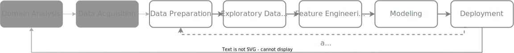
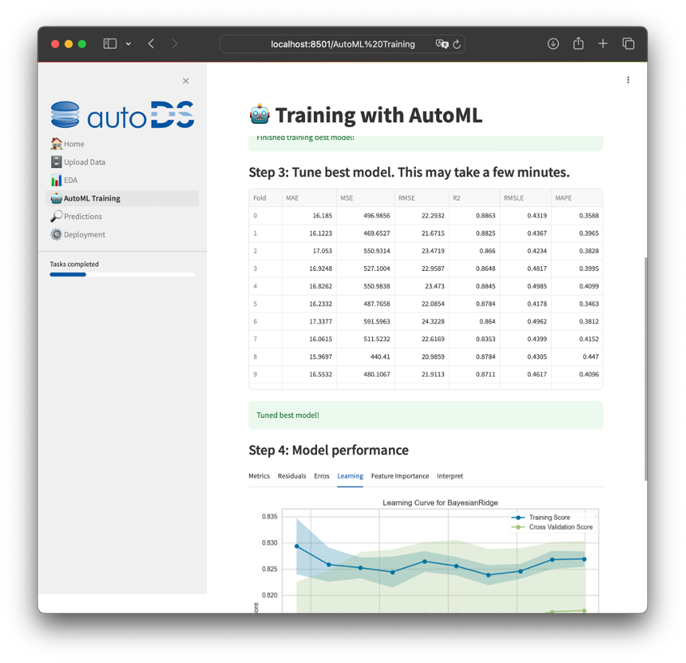

<p align="center">

</p>

<p align="center">
  
</p>

*autoDS* stands for Automatic Data Science and is an Open-Source tool that automates as many phases of the data science life cycle as possible. This tool makes it possible to automatically train a regression model for a specific label, use it to make predictions and deploy it as an API.

- **Upload data**: Load the pre-processed data set, select the label and prepare for next steps.
- **EDA**: Explore data in deeply with Exploratory Data Analysis.
- **Training**: A (new) best model is trained with AutoML.
- **Prediction**: You can make predictions with an old or new model.
- **Deployment**: You can deploy the trained model to an API, used for other systems.



## Screenshot

<p align="center">

</p>

## How to use

Don't forget to rename [sample.env](sample.env) to `.env`!

**Step: 1 Install dependencies via `pip`**
```
python3 -m pip install pipenv
python3 -m pipenv install
```

**Step 2: Run server**
```shell
python3 -m pipenv run server
```

**Step 3: Test API after successfully run**
```shell
python3 -m pipenv run api
```

Call URL http://localhost:8501 or change frontend with [configuration](./.streamlit).

## Used tech stack

- Backend: Python 3.11
- API: [FastAPI](https://github.com/tiangolo/fastapi)
- Frontend: [Streamlit](https://github.com/streamlit)
- AutoML: [PyCaret](https://github.com/pycaret/pycaret)
- EDA: [Pandas and YData Profiling](https://github.com/ydataai/ydata-profiling)
